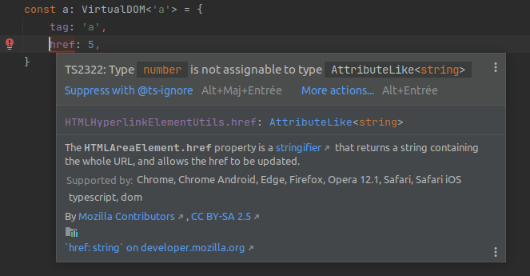
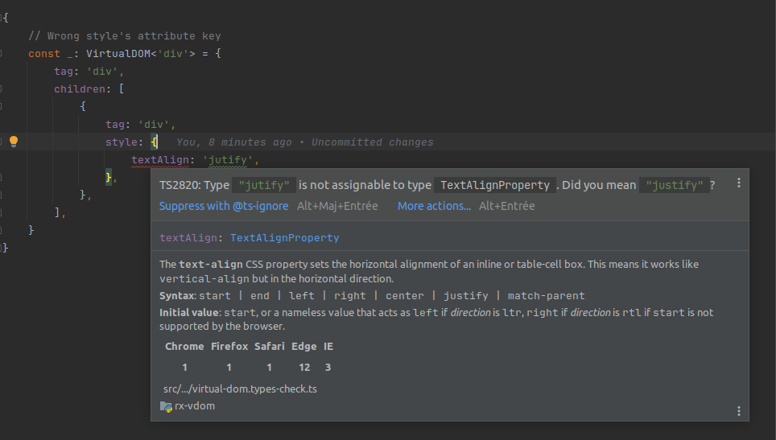

# Type safety

We have placed significant emphasis on providing comprehensive type checking for virtual DOM elements,
aligning them with their corresponding HTML elements.
This results in an enhanced development experience when using TypeScript. For example:

-no-href.png" class="w-100 my-1">

# Common compilation issues

<note level="hint">
In case of a compilation error in a nested VirtualDOM definition, a good strategy is to sequentially comment out parts 
of the VirtualDOM to narrow down the error location. Sometimes, the error reported by the compiler is associated with
a direct or indirect parent of the problematic node.
</note>

## HTML tag not recognized

As explained on the [installation page](@nav/how-to/install), the TypeScript configuration of the library relies on a
`rx-vdom-config.ts` file. This file defines all the supported HTML tags. Using `type Mode = 'Prod'` handles all HTML
tags, while `type Mode = 'Dev'` restricts to a subset, speeding up compilation.

If you are not using `Prod` mode and encounter obscure compilation errors, switch back to `Prod` mode.
If the error disappears, add the missing HTML tags used in your project's VirtualDOM to the `DevTags` type definition.
The tags can usually be identified from the error messages.

## Type inference limitations

TypeScript is generally good at inferring the recursive structure of VirtualDOM and the types of associated attributes.
However, there are a couple of limitations.

### `vdomMap` argument inference

A current limitation (as of TypeScript version 5.3.3) is the inability to infer the argument type of the `vdomMap`
callback used to define reactive properties.

<code-snippet language="javascript" highlightedLines="7">
const _: VirtualDOM<'div'> = {
    tag: 'div' as const,
    // Pb: innerText is inferred as 
    // RxAttribute<unknown, string> and not 
    // RxAttribute<string, string>
    innerText: {
        source$: of('foo'),
        vdomMap: (m) => m,
    },
}
</code-snippet>

<note level="warning" label="TS2322: Type 'unknown' is not assignable to type 'string'."></note>

This is because `innerText` should be string (as it should),
while `m` is inferred as `unknown`.

The simplest solution is to explict the type of `m`:

<code-snippet language="javascript" highlightedLines="4">
const _: VirtualDOM<'div'> = {
    tag: 'div' as const,
    innerText: {
        source$: of('foo'),
        vdomMap: (m: string) => m,
    },
}
</code-snippet>

### `string` vs `type literal` inference

A common problem encountered is typescript inferring a property as string, while the intention is to have
a type literal.

For instance in the following snippet:

<code-snippet language="javascript" highlightedLines="9">
// child is inferred as { tag: 'string' } and not { tag: 'div' }
const child = {
    tag: 'div' // adding ' as const' fix the issue 
}

const parent : VirtualDOM<'div'> = {
tag: 'div',
children: [
// Problem: { tag: 'string' } can not be converted to { tag: SupportedHTMLTags }
child
]
}
</code-snippet>

The `tag` property of `child` is inferred as `string` while the intention is to have the type literal `div`.
Which leads in an error in the definition of parent at the line highlighted. The solutions are:

- Annotate the type of `child` with `Virtual<'div'>`
- Provide `tag: 'div' as const` instead `tag: 'div'` in `child`.
- Inline the definition of `child` within `parent`.

The same issue can arise when defining style, for instance this is invalid:

<code-snippet language="javascript" highlightedLines="8">
const style = {
    textAlign: 'left' // adding ' as const' fix the issue 
}

const div: VirtualDOM<'div'> = {
tag: 'div',
// Types of property 'textAlign' are incompatible.
// Type 'string' is not assignable to type 'TextAlignProperty'.
style,
}
</code-snippet>

Using `textAlign: 'left' as const` resolves the issue.
